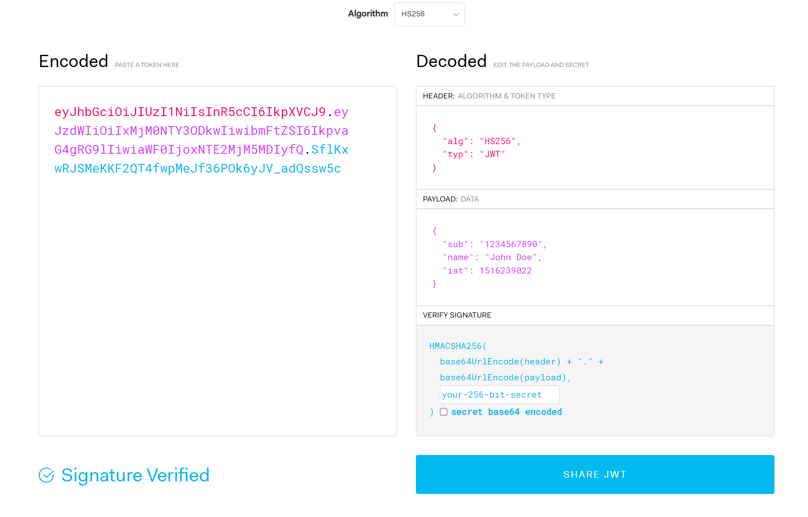
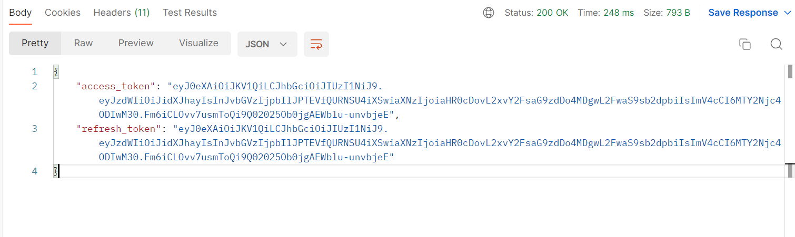
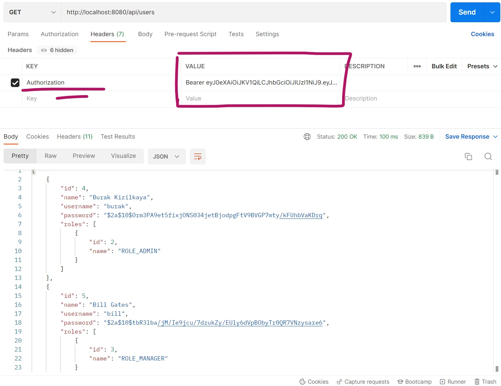

<h1> <b> userservice-jwt </h1> </b>

### This project is a demo for how to use JWT & Security Concept in Spring Environment.
 
 
<h2> 0-) What is JWT? </h2>
<h4> "JWT is an open standard that defines a compact and self-contained way for securely transmitting information between parties as a <b> JSON Object</b>" </h4>
<h4> Makes authorization processes fast and secure. </h4> 
<h4> JSON Web Tokens consist of three parts separated by dots (.) </h4>  
 

  
<h2> 1-) Access Tokens & Refresh Tokens </h2>  
 

  

<h2> 2-) Authorization Example </h2> 

  
